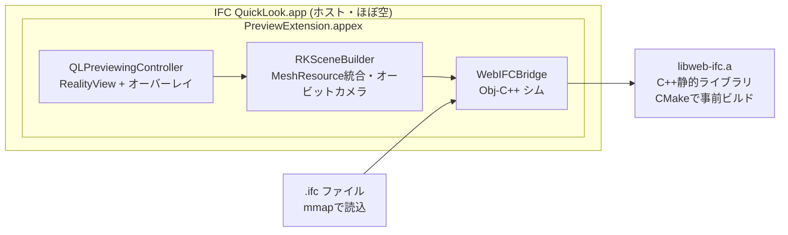

# IFC Quick Look 設計ドキュメント

日付: 2026-07-12
ステータス: 承認待ち

## 目的

macOS の Quick Look（スペースキー）で `.ifc`（BIM / IFC-SPF）ファイルを 3D インタラクティブ表示できるようにする。既存の完成品は存在しないことを事前調査で確認済み。

## 要件（確定事項）

| 項目 | 決定 |
|---|---|
| 最重要制約 | **軽さ = 表示速度（体感）とメモリ・CPU負荷**。アプリサイズ・実装コストは劣後 |
| スコープ | **プレビュー拡張のみ**（スペースキー）。サムネイル拡張は作らない |
| 表示形式 | 3D インタラクティブ（回転・ズーム・パン） |
| 対象規模 | **数百MB級の IFC も真面目に対応**。目標: 初回描画1秒以内（プログレッシブ）、フル表示は数秒〜十数秒 |
| 配布 | まず自分用（開発署名）→ 将来 GitHub で OSS 公開（notarize 付き dmg）。App Store は対象外 |
| 対応スキーマ | IFC2x3 / IFC4 / IFC4x3（web-ifc の対応範囲） |
| 対応macOS | 15+（開発機は macOS 26） |

## アーキテクチャ選定

### ジオメトリエンジン: web-ifc（ThatOpen/engine_web-ifc）ネイティブビルド — 案1を採用

検討した代替案:

- **案2: web-ifc WASM + WKWebView + Three.js** — 実装は最軽量だが、WASM はネイティブ比で約半速・Webスタック分のメモリ増。軽さ最優先の要件に対して一段劣るため不採用
- **案3: IfcOpenShell / IfcConvert** — OpenCASCADE ベースで高精度だが数百MB級では分単位。速度要件に反するため不採用
- **Pure Swift 自前実装** — IFC ジオメトリ（押し出し・ブーリアン・BRep・スイープ）の実装量が非現実的。不採用

採用理由: web-ifc は OpenCASCADE を使わない速度特化の IFC 専用 C++ エンジン（旧 IFC.js の中核）。ネイティブビルドが公式サポートされ、数百MB を秒オーダーでパース＋テッセレーションできる。MPL-2.0 で OSS 公開とも整合。

### 描画: RealityKit

SceneKit は WWDC25 で正式 deprecated のため不採用。Metal 直描画（最速・最軽量）も検討したが、実装コストが数倍かかるため、Apple の現行推奨パスである RealityKit を採用。メッシュは MeshDescriptor（必要に応じて macOS 15+ の LowLevelMesh でゼロコピー化）で生成し、**マテリアル単位で ModelEntity に統合**してドローコール数を抑える。オービットカメラは自作（PerspectiveCamera エンティティを操作）。

## 全体構成

### コンポーネント責務

| コンポーネント | 責務 | 依存 |
|---|---|---|
| ホストアプリ | appex の入れ物。`.ifc` の UTI 宣言（imported type）。説明画面 + **単体ビューアウィンドウ**（開発・目視確認用） | appex と同じコアを利用 |
| PreviewExtension.appex | `preparePreviewOfFile` でファイル URL を受け、3D ビューを表示。サンドボックス内（対象ファイルの読み取り権限は QL が自動付与） | MetalRenderer, WebIFCBridge |
| WebIFCBridge (Obj-C++) | web-ifc の C++ API を包み、Swift へ「メッシュストリーム（頂点・法線・インデックス・色・変換行列）」のみを公開。C++ 露出をこの 1 ファイルに閉じ込める。C++ 例外は全て捕捉して Result 化 | libweb-ifc.a |
| RKSceneBuilder | 色（マテリアル）別に MeshResource / ModelEntity へ統合、オービットカメラ、プログレッシブ追記 | RealityKit |
| CLI ベンチ | パース時間・三角形数・ピークメモリ計測。性能回帰チェック用 | WebIFCBridge |
| libweb-ifc.a | git submodule + CMake スクリプトで静的ライブラリ化。ランタイム依存ゼロ | — |

## データフロー（スペースキー → 表示）

1. QL が appex を起動、`preparePreviewOfFile` にファイル URL
2. `.ifc` を **mmap**（コピーせず web-ifc に渡す）
3. web-ifc がパース → ジオメトリを**要素単位でストリーム生成**（コールバック）
4. メッシュを**色ごとに統合して MeshResource / ModelEntity 化** — エンティティ数・ドローコール数を色数程度（通常 10〜50）に抑える
5. **最初のバッチが揃った時点（目標 1 秒以内）で描画開始**、残りは背景スレッドで流し込む（建物が徐々に現れる）
6. 完了後にバウンディングボックスでカメラフレーミング確定、オーバーレイに要素数・スキーマ版・読込時間を表示

## パフォーマンス・メモリ戦略

- パース完了後、web-ifc 側のトークンバッファを即解放。保持は **MeshResource（GPU側）+ 色テーブルのみ**（中間の CPU 頂点配列は統合後に破棄）
- プロパティ・関係情報は一切保持しない（プレビューに不要）
- 頂点レイアウト: position(float3) + normal(float3)、インデックス 32bit。1000万三角形 ≈ GPU バッファ数百MB を想定
- **三角形数上限 2000万**。超過分はスキップし「⚠︎ N要素を省略」と表示（silent にしない）
- QL に殺されないよう、ロード中も UI スレッドはブロックしない（先に部分表示 + プログレス）

## カメラ操作（自作オービット）

- ドラッグ = オービット / スクロール・ピンチ = ズーム / 右ドラッグ or Shift+ドラッグ = パン
- 初期視点: モデル bbox 中心を注視点に斜め上 45° の等角風

## エラーハンドリング（Fail Fast）

- パース失敗 / 非対応スキーマ / ジオメトリゼロ → エラービューで**理由を明示**（「壊れたファイル」「スキーマ X.X 非対応」等）。空画面・汎用アイコンに逃げない
- 三角形上限による省略・要素単位の変換失敗はオーバーレイで必ず可視化
- C++ 例外はシム層で全捕捉 → Swift の Result に変換。appex のクラッシュは QL 全体を巻き込まないが、原則クラッシュさせない

## テスト方針

- **コア（Bridge / メッシュ統合）**: buildingSMART 公式サンプル IFC（数KB〜数MB）で XCTest。頂点数・色数・bbox の期待値を固定
- **性能**: CLI ベンチで「パース時間・三角形数・ピークメモリ」を計測。大きいファイルで回帰チェック
- **appex 実体**: 自動テスト困難のため、ホストアプリ内蔵の単体ビューアで目視確認 → 最後に QL 実機確認

## マイルストーン（小さく回す）

1. **M1**: web-ifc を CMake でネイティブビルドし、CLI で「サンプルIFC → 三角形数出力」まで（エンジン検証。**最大リスクなので最初に潰す**）
2. **M2**: Metal レンダラ + オービットカメラで単体ビューア表示
3. **M3**: QL appex 化（ホストアプリ・UTI 宣言・サンドボックス）、スペースキーで表示
4. **M4**: プログレッシブ表示・メモリ上限・エラー表示の仕上げ
5. **M5**: 数百MB級での性能チューニング

## 実装体制メモ

- 実装難易度が高い（C++/Swift 連携・大規模メッシュの RealityKit 描画）ため、実装は **Fable 5 モデルで行う**（subagent を使う場合も fable 指定）

## スコープ外（YAGNI）

- サムネイル拡張（Finder アイコン）
- プロパティ / IfcSpace 等のメタデータ表示・要素選択
- App Store 配布・サンドボックス外機能
- IFC 編集・変換機能
